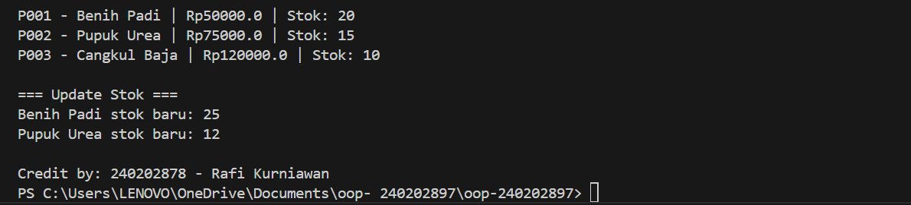

#Laporan Praktikum Minggu 2
Topik: Class dan Object (Produk Pertanian)

##Identitas
-Nama: Fakhri Fahmi Ramadan 
-NIM: 240202897
-Kelas: 3IKRB
##Tujuan
-Mahasiswa mampu menjelaskan konsep class, object, atribut, dan method dalam OOP.
-Mahasiswa mampu menerapkan access modifier dan enkapsulasi dalam pembuatan class.
-Mahasiswa mampu mengimplementasikan class Produk pertanian dengan atribut dan method yang sesuai.
-Mahasiswa mampu mendemonstrasikan instansiasi object serta menampilkan data produk pertanian di console.
-Mahasiswa mampu menyusun laporan praktikum dengan bukti kode, hasil eksekusi, dan analisis sederhana.
##Dasar Teori
Class adalah cetak biru (blueprint), rancangan, atau prototipe yang mendefinisikan sifat (atribut) dan perilaku (method) yang umum untuk semua objek dari jenis tertentu. Class sendiri bukan data, melainkan definisi tentang bagaimana data akan dibuat dan dikelola.
Object adalah instansiasi (wujud nyata) dari sebuah Class. Setiap objek memiliki salinan dari atribut yang didefinisikan dalam Class dan dapat menggunakan method yang ada.
Enkapsulasi ekanisme penggabungan data (atribut) dengan method (perilaku) yang beroperasi pada data tersebut menjadi satu unit (class), sekaligus mengendalikan akses ke data tersebut. Konsep ini sering disebut sebagai "data hiding" (penyembunyian data).
Langkah Praktikum
Membuat Class Produk

Buat file Produk.java pada package model.
Tambahkan atribut: kode, nama, harga, dan stok.
Gunakan enkapsulasi dengan menjadikan atribut bersifat private dan membuat getter serta setter untuk masing-masing atribut.
Membuat Class CreditBy

Buat file CreditBy.java pada package util.
Isi class dengan method statis untuk menampilkan identitas mahasiswa di akhir output: credit by: <NIM> - <Nama>.
Membuat Objek Produk dan Menampilkan Credit

Buat file MainProduk.java.
Instansiasi minimal tiga objek produk, misalnya "Benih Padi", "Pupuk Urea", dan satu produk alat pertanian.
Tampilkan informasi produk melalui method getter.
Panggil CreditBy.print("<NIM>", "<Nama>") di akhir main untuk menampilkan identitas.
Commit dan Push

Commit dengan pesan: week2-class-object.
Kode Program
Produk.java
package com.upb.agripos.model;

public class Produk {
    private String kode;
    private String nama;
    private double harga;
    private int stok;

    public Produk(String kode, String nama, double harga, int stok) {
        this.kode = kode;
        this.nama = nama;
        this.harga = harga;
        this.stok = stok;
    }

    public String getKode() { return kode; }
    public void setKode(String kode) { this.kode = kode; }

    public String getNama() { return nama; }
    public void setNama(String nama) { this.nama = nama; }

    public double getHarga() { return harga; }
    public void setHarga(double harga) { this.harga = harga; }

    public int getStok() { return stok; }
    public void setStok(int stok) { this.stok = stok; }

    public void tambahStok(int jumlah) {
        this.stok += jumlah;
    }

    public void kurangiStok(int jumlah) {
        if (this.stok >= jumlah) {
            this.stok -= jumlah;
        } else {
            System.out.println("Stok tidak mencukupi!");
        }
    }
}
CreditBy.java
package com.upb.agripos.util;

public class CreditBy {
    public static void print(String nim, String nama) {
        System.out.println("\ncredit by: " + nim + " - " + nama);
    }
}
MainProduk.java
package com.upb.agripos;

import com.upb.agripos.model.Produk;
import com.upb.agripos.util.CreditBy;

public class MainProduk {
    public static void main(String[] args) {
        Produk p1 = new Produk("BNH-001", "Benih Padi IR64", 25000, 100);
        Produk p2 = new Produk("PPK-101", "Pupuk Urea 50kg", 350000, 40);
        Produk p3 = new Produk("ALT-501", "Cangkul Baja", 90000, 15);

        System.out.println("Kode: " + p1.getKode() + ", Nama: " + p1.getNama() + ", Harga: " + p1.getHarga() + ", Stok: " + p1.getStok());
        System.out.println("Kode: " + p2.getKode() + ", Nama: " + p2.getNama() + ", Harga: " + p2.getHarga() + ", Stok: " + p2.getStok());
        System.out.println("Kode: " + p3.getKode() + ", Nama: " + p3.getNama() + ", Harga: " + p3.getHarga() + ", Stok: " + p3.getStok());

        // Tambah dan kurangi stok
        p1.tambahStok(50);
        p2.kurangiStok(20);
        p3.tambahStok(10);

        System.out.println("\nSetelah update stok:");
        System.out.println("Kode: " + p1.getKode() + ", Nama: " + p1.getNama() + ", Harga: " + p1.getHarga() + ", Stok: " + p1.getStok());
        System.out.println("Kode: " + p2.getKode() + ", Nama: " + p2.getNama() + ", Harga: " + p2.getHarga() + ", Stok: " + p2.getStok());
        System.out.println("Kode: " + p3.getKode() + ", Nama: " + p3.getNama() + ", Harga: " + p3.getHarga() + ", Stok: " + p3.getStok());

        CreditBy.print("240202898", "Fendy Agustian");
    }
}

---

## Hasil Eksekusi

  

---
