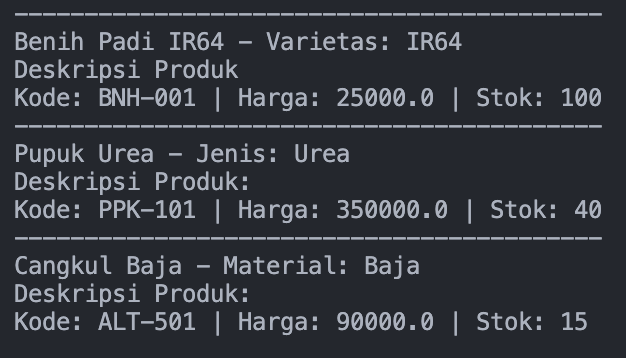

# Laporan Praktikum Minggu 2
Topik: Inheritance (Kategori Produk)

## Identitas
- Nama  : Wahyu Tri Cahya
- NIM   : 240202889
- Kelas : 3IKRB

---

## Tujuan
- Mahasiswa mampu **menjelaskan konsep inheritance (pewarisan class)** dalam OOP.  
- Mahasiswa mampu **membuat superclass dan subclass** untuk produk pertanian.  
- Mahasiswa mampu **mendemonstrasikan hierarki class** melalui contoh kode.  
- Mahasiswa mampu **menggunakan `super` untuk memanggil konstruktor dan method parent class**.  
- Mahasiswa mampu **membuat laporan praktikum** yang menjelaskan perbedaan penggunaan inheritance dibanding class tunggal.  

---

## Dasar Teori
Inheritance adalah mekanisme dalam OOP yang memungkinkan suatu class mewarisi atribut dan method dari class lain.  
- **Superclass**: class induk yang mendefinisikan atribut umum.  
- **Subclass**: class turunan yang mewarisi atribut/method superclass, dan dapat menambahkan atribut/method baru.  
- `super` digunakan untuk memanggil konstruktor atau method superclass.  

---

## Langkah Praktikum
1. **Membuat Superclass Produk**  
   - Gunakan class `Produk` dari Bab 2 sebagai superclass.  

2. **Membuat Subclass**  
   - `Benih.java` → atribut tambahan: varietas.  
   - `Pupuk.java` → atribut tambahan: jenis pupuk (Urea, NPK, dll).  
   - `AlatPertanian.java` → atribut tambahan: material (baja, kayu, plastik).  

3. **Membuat Main Class**  
   - Instansiasi minimal satu objek dari tiap subclass.  
   - Tampilkan data produk dengan memanfaatkan inheritance.  

4. **Menambahkan CreditBy**  
   - Panggil class `CreditBy` untuk menampilkan identitas mahasiswa.  

5. **Commit dan Push**  
   - Commit dengan pesan: `week3-inheritance`.  

---

## Kode Program
```java
        Pupuk p = new Pupuk("PPK-101", "Pupuk Urea", 350000, 40, "Urea");
        AlatPertanian a = new AlatPertanian("ALT-501", "Cangkul Baja", 90000, 15, "Baja");

        System.out.println("------------------------------------");
        System.out.println(b.deskripsi());

        System.out.println("------------------------------------");
        System.out.println(p.deskripsi());
        
        System.out.println("------------------------------------");
        System.out.println(a.deskripsi());

        CreditBy.print("240202889", "Wahyu Tri Cahya");
```
---

## Hasil Eksekusi

---

## Analisis
- Ketiga subclass (`Benih`, `Pupuk`, dan `AlatPertanian`) **mewarisi atribut dan method** dari superclass `Produk`.  
- Setiap subclass menambahkan **atribut unik** yang relevan dengan jenis produknya.  
- Method `deskripsi()` menampilkan informasi lengkap dengan memanfaatkan pewarisan.  
- Dibanding minggu sebelumnya (tanpa inheritance), kode lebih **efisien**, **terstruktur**, dan **mudah dikembangkan**. 
---

## Kesimpulan
- Inheritance membuat program lebih terorganisir dan menghindari duplikasi kode.  
- Subclass dapat memperluas fungsionalitas superclass tanpa perlu menulis ulang atribut dan method dasar.  
- Praktikum ini memperkuat pemahaman konsep **reusability dan extensibility** dalam OOP.  
---

## Quiz
1. **Apa keuntungan menggunakan inheritance dibanding membuat class terpisah tanpa hubungan?**  
   **Jawaban:** Kode menjadi lebih efisien dan mudah dipelihara karena atribut dan method umum hanya didefinisikan satu kali di superclass.  

2. **Bagaimana cara subclass memanggil konstruktor superclass?**  
   **Jawaban:** Dengan menggunakan `super(parameter)` di baris pertama konstruktor subclass.  

3. **Berikan contoh kasus di POS pertanian selain Benih, Pupuk, dan Alat Pertanian yang bisa dijadikan subclass.**  
   **Jawaban:** Subclass `Pestisida` dengan atribut tambahan seperti `bahanAktif` dan `dosisPenggunaan`.  